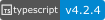

# Portfolio

Personal web by Francisco Casales.

<div class="badges">
    <a href="https://github.com/FranciscoCasales/FranciscoCasales.github.io"></a>
    <a href="https://github.com/facebook/react"></a>
    <a href="https://www.npmjs.com/"></a>
    <a href="https://webpack.js.org/"></a>
    <a href="https://nodejs.org/es/"></a>
    <a href="https://github.com/paypal/react-paypal-js/blob/main/LICENSE"></a>
</div>

<div align="center" style="display: flex; align-items: center">
   <h1>Francisco<strong style="color: #215968;">Casales 👨🏽‍💻</strong></h1>
</div>

## Included Configuration

- Babel configuration to transpile jsx

- Webpack configuration with the next listed plugins and loaders

  - HtmlWebpackPlugin to load html files
  - MiniCssExtractPlugin to load css files
  - CssMinimizerPlugin to minify css
  - Css loader to unify all css files
  - Sass loader to transpile sass files to css`
  - Image loader to load images as import
  - Font loader
  - Webpack alias to improve imports
  - TerserPlugin to minify js files

## Instalation

Use the package manage [npm](https://docs.npmjs.com/cli/v7/configuring-npm/install) to install dependencies and run the project

```bash
  cd React
  npm install
  npm run start
```
